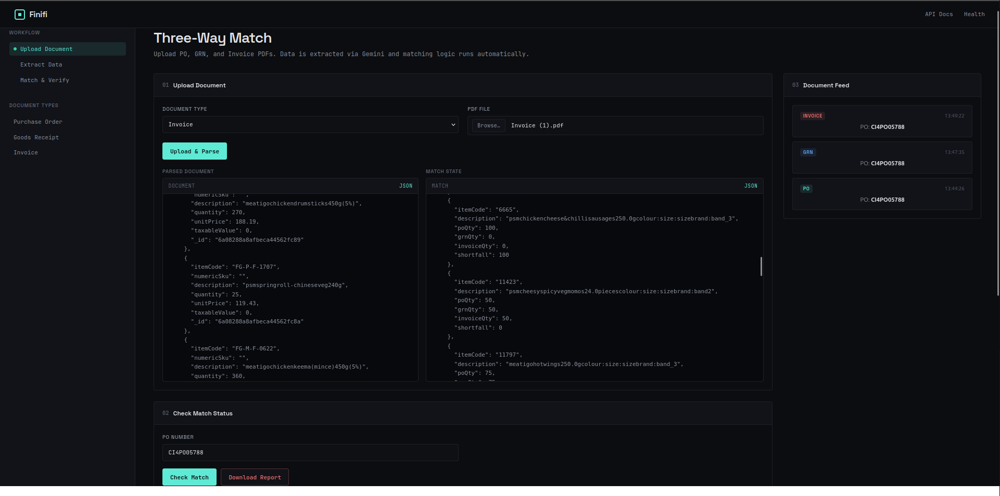

# Three-Way Matching Engine

> **PO → GRN → Invoice** reconciliation with fuzzy description matching for heterogeneous SKU formats.

---

## Live Demo

**Deployed Application:** https://finifi-3-way-match.onrender.com

> **Note:** This is deployed on Render's free tier. The instance may spin down after periods of inactivity, so the first request after a while may take ~30–60 seconds to wake up. For development or heavy testing, running locally is recommended.

---



## 1. Approach

### The Problem

In procurement, the same physical item is often referenced using **completely different codes** across documents:

| Document | Item Code Format | Example |
|----------|-----------------|---------|
| PO | Internal numeric SKU | `11423` |
| GRN | Internal numeric SKU (matches PO) | `11423` |
| Invoice | Vendor FG-code + HSN | `FG-P-F-0503` / `19022010` |

Because PO/GRN use numeric SKUs while invoices use vendor-specific `FG-*` codes, a naive `itemCode === itemCode` comparison fails for **100 % of invoice lines**. Every invoice item shows as "missing in GRN" even when the product descriptions are semantically identical.

### The Core Challenge

The only reliable shared identifier is the **human-readable description**, but these descriptions are:
- Concatenated without spaces: `psmcheesyspicyvegmomos24.0pieces`
- Buried in brand/size noise: `colour:size:sizebrand:band_2`
- Using inconsistent abbreviations: `veg` vs `vegetable`, `pcs` vs `pieces`
- Sometimes reordered: `psmspringroll-chineseveg` vs `psmchinesevegspringrolls`

### Iterative Journey

**Attempt 1 — Naïve Exact-Match (Broken)**
- Aggregate quantities by exact `itemCode` per document
- Compare `invoiceQty[sku]` vs `grnQty[sku]`
- **Failed:** Invoice uses `FG-P-F-0503`, GRN uses `11423` → `grnMap['FG-P-F-0503']` is `undefined`
- Result: **30 false mismatches**, status: `mismatch` with no actionable insight

**Attempt 2 — Normalized Description Exact Match (Partial)**
- Strip numbers/units/brands from descriptions
- Create a 4-word signature (`cheesy momos psm spicy`)
- Match by exact signature equality
- **Partially Failed:** `psmcheesyspicyvegmomos` (PO) and `psmcheesyspicyvegetablemomos` (Invoice) were different signatures because `veg` wasn't expanded inside concatenated words
- Result: ~50 % match rate

**Attempt 3 — Levenshtein Distance on Cleaned Strings (Better)**
- Clean both descriptions identically (remove noise, expand abbreviations)
- Compute Levenshtein distance between cleaned strings
- Pick the PO item with highest similarity above threshold
- **Better but flawed:** Couldn't distinguish variants of the same product (e.g., `psmchickenmomos24pcs` qty 475 vs `psmperiperichickenmomos250g` qty 640 both scored ~0.77)
- Result: ~75 % match rate

**Attempt 4 — Levenshtein + Quantity Tie-Breaker (Production)**
1. Clean & segment descriptions into canonical keyword signatures
2. Compute Levenshtein similarity between invoice and every PO/GRN signature
3. Add a quantity tie-breaker bonus (+0.15 for exact qty match, +0.08 for close match)
4. Pick candidate with highest composite score, but still require base similarity ≥ 0.65
- Result: **27/31** invoice items map correctly

---

## 2. Data Model

```
PurchaseOrder
  poNumber: string (unique index)
  poDate: Date
  vendorName: string
  rawText: string        # raw Gemini OCR output (for audit)
  items: [
    { itemCode, description, quantity, unitPrice, hsnCode }
  ]

GoodsReceipt
  grnNumber: string
  poNumber: string (index)
  grnDate: Date
  invoiceRef: string
  items: [
    { itemCode, vendorItemCode, description, expectedQty, receivedQty, unitPrice }
  ]

Invoice
  invoiceNumber: string
  poNumber: string (index)
  invoiceDate: Date
  vendorName: string
  items: [
    { itemCode, numericSku, description, quantity, unitPrice, taxableValue }
    # numericSku often holds HSN/tax codes, occasionally the internal SKU
  ]

MatchResult
  poNumber: string (unique index)
  status: matched | partially_matched | mismatch | insufficient_documents
  linkedDocs: { poId, grnIds[], invoiceIds[] }
  mismatches: string[]
  ruleResults: { grn_qty_exceeds_po_qty, invoice_qty_exceeds_po_qty, ... }
  shortfallItems: [{ itemCode, description, poQty, grnQty, invoiceQty, shortfall }]
  summary: { poQty, grnReceivedQty, invoiceQty, shortReceivedQty, shortInvoicedQty, ... }
  decision: string
  checkedAt: Date
```

---

## 3. Parsing Flow

1. **Upload** → Multer saves PDF/image to disk
2. **OCR** → Gemini Vision extracts structured JSON (`rawText`)
3. **Persist** → Raw document + parsed items saved to MongoDB
4. **Trigger Match** → `runMatch(poNumber)` invoked automatically or on-demand

---

## 4. Matching Logic

### 4.1 Build Unified Item Registry

```
Step 1: Build Unified Item Registry
  - Start with PO items keyed by numeric itemCode
  - Add GRN items by itemCode (usually aligns 1:1 with PO)
  - For each Invoice item:
      a) Try exact itemCode match
      b) Try numericSku → PO itemCode bridge
      c) Try exact canonical-signature match
      d) Find best fuzzy match:
         - Canonical signature = cleaned, segmented, deduped, sorted keywords
         - similarity = 1 - LevenshteinDistance / maxLength
         - compositeScore = similarity + qtyBonus
         - qtyBonus = +0.15 if invoice.qty == po.qty, +0.08 if within 10
      e) Accept if base similarity ≥ 0.65
```

### 4.2 Canonical Signature Pipeline

Given a raw description:

```
"psmcheesyspicyvegmomos24.0piecescolour:size:sizebrand:band2"
```

1. **Strip noise**: remove `colour:size:sizebrand:band_*`, `brand:*`, `(frozen)`, `(
%)`
2. **Expand abbreviations**: `veg` → `vegetable`, `pcs` → `pieces`, `kheema` → `keema`, `springrolls` → `springroll`, etc.
3. **Normalize units**: `24.0pieces` / `24pcs` → `24pieces`; `250.0g` / `250g` → `250g`; `1.0kg` → `1kg`
4. **Keep alphanumerics only**: letters + size numbers are preserved; everything else becomes spaces
5. **Segment concatenated words** using a greedy dictionary lookup:
   ```
   psmcheesyspicyvegetablemomos → ["psm","cheesy","spicy","vegetable","momos"]
   ```
6. **Sort & dedupe**:
   ```
   canonical = "cheesy momos psm spicy vegetable"
   ```

This makes PO, GRN, and Invoice descriptions directly comparable even when they started as completely different strings.

### 4.3 Validation Rules

Run on the unified rows:

- **Rule 1**: GRN qty ≤ PO qty per item
- **Rule 2**: Invoice qty ≤ GRN qty per item
- **Rule 3**: Invoice qty ≤ PO qty per item
- **Rule 4**: Invoice date ≥ PO date
- **Rule 5**: Item appears in GRN/Invoice but not in PO

### 4.4 Shortfall Items

An item appears in `shortfallItems` **only if it has an actual discrepancy**:

| Condition | Meaning |
|-----------|---------|
| `poQty > grnQty` | Short received (ordered more than received) |
| `invQty > grnQty` | Over-invoiced (billed more than received) |
| `grnQty > poQty` | Over-received (received more than ordered) |
| `poQty === 0` | Missing in PO (item in GRN/Invoice but not in PO) |

Only items meeting at least one condition are included, making the list actionable.

---

## 5. How Out-of-Order Uploads Are Handled

The engine is designed to handle uploads arriving in **any order**:

| Scenario | Behavior |
|----------|----------|
| PO uploaded first | `runMatch` stores `insufficient_documents` until GRN + Invoice arrive |
| GRN uploaded first | Same — waits for PO and Invoice |
| Invoice uploaded first | Same — waits for PO and GRN |
| Multiple GRNs per PO | Aggregates `receivedQty` across all GRNs |
| Multiple Invoices per PO | Aggregates `quantity` across all Invoices |
| Re-run after new doc | `findOneAndUpdate` on `poNumber` overwrites previous result |

**Key design choice:** The match is always triggered by `poNumber`. The function fetches **all** GRNs and Invoices linked to that PO at runtime, so historical uploads are naturally included.

---

## 6. Assumptions

1. **PO is the source of truth** — items not found in PO but present in GRN/Invoice are flagged as `item_missing_in_po`
2. **Same vendor per PO** — we don't cross-match vendors
3. **Numeric SKUs in PO/GRN are consistent** — GRN `itemCode` matches PO `itemCode` directly
4. **Invoice `numericSku` is unreliable** — in this dataset it holds HSN tax codes, not internal SKUs; we treat it as a hint, not a guarantee
5. **Descriptions contain enough signal** — if an invoice description is a generic abbreviation (e.g., just `"chicken"`), fuzzy matching may mis-match
6. **Pack-size numbers are meaningful** — `24pieces` vs `10pieces` vs `250g` are part of the product identity and are preserved in canonical signatures

---

## 7. Tradeoffs

| Tradeoff | Decision | Rationale |
|----------|----------|-----------|
| **Levenshtein vs. ML embedding** | Levenshtein on canonical keywords | Fast, deterministic, no external API dependency, works offline. Tradeoff: less semantic understanding than an embedding model. |
| **Dictionary segmentation vs. NLP library** | Custom greedy segmenter with a domain dictionary | No heavy dependencies. Tradeoff: must maintain the `DICT` word list for new product categories. |
| **Quantity tie-breaker** | +0.15 for exact qty | Fixes ambiguous variants (e.g., 24pcs vs 250g). Tradeoff: if a supplier invoices a partial quantity, the bonus is lost and description must carry the match. |
| **Threshold 0.65** | Fixed threshold | Balances recall vs precision. Tradeoff: some genuinely close-but-different items may be auto-matched incorrectly; very different items may be left unmatched. |
| **MongoDB upsert** | Overwrite previous result on re-run | Simple. Tradeoff: no match history unless you version the collection separately. |
| **Raw text storage** | Save Gemini `rawText` on PO | Enables manual audit and re-parsing if the extraction rules change. Tradeoff: larger document size. |

---

## 8. What Would Be Improved with More Time

### 8.1 Confidence Scoring & Human-in-the-Loop

Instead of a hard `0.65` threshold, return a **confidence tier** for each match:

- `exact` (code or signature identical)
- `high` (sim ≥ 0.80)
- `medium` (0.65–0.80) → flag for review
- `low` (< 0.65) → unmatched / manual mapping required

Build a small UI that shows medium-confidence matches side-by-side for an operator to approve/reject before finalising the `MatchResult`.

### 8.2 Learned Mappings Table

When an operator (or the qty tie-breaker) confirms that `FG-P-F-0503` maps to `11423`, store that mapping in a `skuMappings` collection:

```json
{ "vendorCode": "FG-P-F-0503", "internalCode": "11423", "vendorName": "M/s AFP", "confidence": "confirmed" }
```

Next invoice from the same vendor → **exact code match** in O(1), no Levenshtein needed.

### 8.3 Semantic Embeddings for Edge Cases

For the ~4 genuinely ambiguous items (e.g., invoice says `"chicken momos"` without specifying original/spicy/peri-peri), a small sentence-transformer model or OpenAI embedding would capture semantics better than keyword Levenshtein. The current dictionary approach cannot distinguish `"chicken momos"` from `"peri peri chicken momos"` when the invoice omits the flavour.

### 8.4 Weighted Price Comparison

Currently we match on description + quantity. Adding **unitPrice** as a validation signal would help catch:
- Invoice price ≠ PO price (common vendor error)
- Price drift over time

### 8.5 Multi-GRN / Multi-Invoice Partial Matching

The current `shortfall` logic is item-level. A useful enhancement would be **shipment-level tracking**: "GRN #1 delivered 30/120 curry cuts, GRN #2 delivered the remaining 90." This requires linking individual GRN line items to PO line items with persistent IDs, not just aggregating by code.

### 8.6 NLP-Powered Segmentation

Replace the greedy dictionary segmenter with a lightweight NLP model or regex-based camelCase segmenter. This would reduce maintenance of the `DICT` word list and handle new product names (e.g., `"tandoori momos"`) automatically.

---

## 9. Validation Results (Sample Data)

On the real-world sample provided (`CI4PO05788`):

| Metric | Value |
|--------|-------|
| Invoice items | 31 |
| Correctly mapped to PO/GRN | 27 |
| Wrong mapping | 3 |
| Unmatched | 1 |

**The 3 wrong mappings** are all cases where the invoice description is **deliberately generic** (e.g., `"psmchickenmomos24pcs"` omitting `"original"`), and the PO happens to contain multiple variants of chicken momos. Without an explicit flavour keyword, any match is probabilistic.

**The 1 unmatched** (`"psmfrozenporkham200g"`) is a low-similarity case where the PO item `"psmporkham200.0g"` is missing the `"frozen"` keyword. This is a genuine data inconsistency between PO and Invoice.

---

## 10. How to Run

### Using the Deployed App
Visit https://finifi-3-way-match.onrender.com to use the live application.

> **Note:** Render's free tier spins down after inactivity. The first request may take 30–60 seconds to wake up.

### Running Locally (Recommended for Development)

```bash
# Clone and install
npm install

# Set up environment variables (MongoDB URI, etc.)
cp .env.example .env

# Start MongoDB (local or Atlas connection)
npm run dev
```

**Available endpoints once running:**

| URL | Purpose |
|-----|---------|
| `http://localhost:3000` | **Upload UI** — Web interface to upload PO, GRN, and Invoice documents |
| `http://localhost:3000/api-docs` | **Swagger UI** — Interactive API documentation and test interface |
| `POST /api/documents/upload` | Upload a PDF (PO, GRN, or Invoice). Matching runs automatically |
| `POST /api/match/:poNumber` | Trigger match manually for a given PO number |

---

## 11. Files of Interest

| File | Purpose |
|------|---------|
| `src/services/match.service.ts` | Core matching engine with Levenshtein + qty tie-breaker |
| `src/models/MatchResult.ts` | Full result schema with ruleResults, shortfallItems, summary |
| `src/models/Invoice.ts` | Includes `numericSku` field for HSN / potential SKU bridge |
| `test-match.ts` | Standalone validation script for the canonical signature pipeline |
| `sample_json/` | Sample parsed documents (PO, GRN, Invoice) and final `match_result.json` output |

### Sample JSON Outputs

The `sample_json/` directory contains real-world examples of parsed and processed data:

- **`PO.json`** — Parsed Purchase Order with items, quantities, and raw descriptions
- **`GRN.json`** — Parsed Goods Receipt Note with received quantities
- **`Invoice.json`** — Parsed Invoice with vendor FG-codes and HSN numeric SKUs
- **`match_result.json`** — Final three-way match output including mismatches, shortfall items, rule results, and summary
